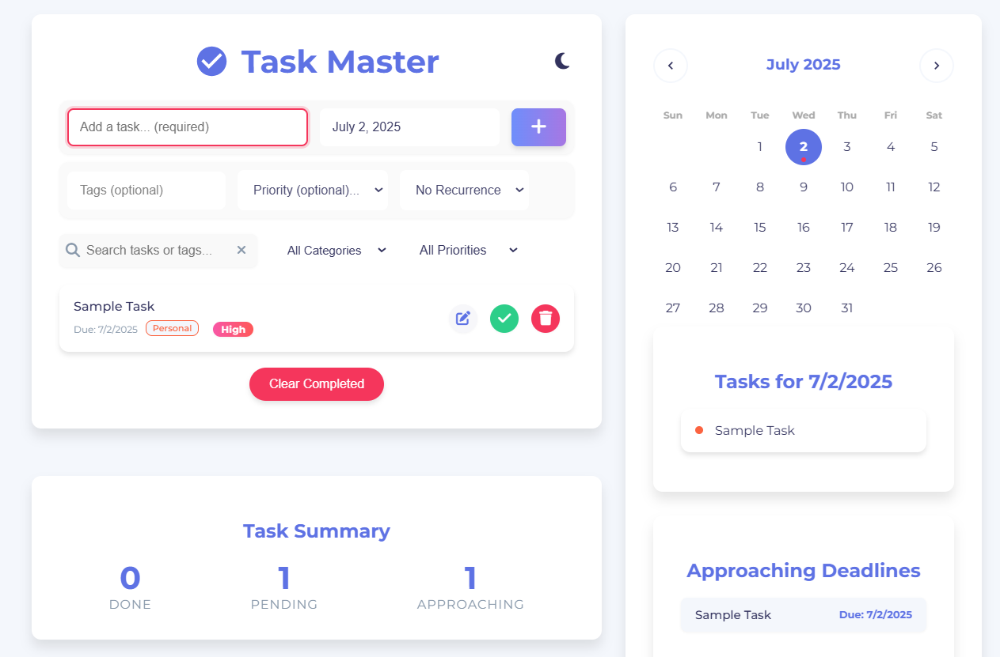

# Task Master

A modern and feature-rich to-do list application designed to help you manage your tasks efficiently. Built with vanilla HTML, CSS, and JavaScript, this project demonstrates a clean, responsive, and intuitive user interface for task management.

## Live Demo

[Link to a live demo will be here once deployed.]

## Screenshot

 


## Features

- **Task Management:** Add, edit, delete, and mark tasks as complete.
- **Due Dates:** Assign due dates to tasks using an elegant date picker.
- **Priorities:** Set task priorities (High, Medium, Low) to focus on what matters most.
- **Categorization:** Organize tasks with custom tags (e.g., Work, Personal, Shopping).
- **Recurring Tasks:** Set up tasks to recur daily, weekly, or monthly.
- **Interactive Calendar:** A full-featured calendar to visualize tasks by date. Click on any date to see the tasks scheduled for that day.
- **Search & Filter:**
    - Instantly search for tasks by name or tag.
    - Filter tasks by category or priority level.
- **Task Views:**
    - **All Tasks:** View all your tasks in one place.
    - **Active:** See only the tasks that are not yet completed.
    - **Completed:** Review all your completed tasks.
- **Task Summary:** Get a quick overview with a summary of your completed, pending, and approaching tasks.
- **Approaching Deadlines:** A dedicated section for tasks due within the next few days.
- **Dark/Light Theme:** Switch between dark and light modes for comfortable viewing.
- **Responsive Design:** A fully responsive interface that works seamlessly on desktops, tablets, and mobile devices.
- **Persistent Storage:** All tasks are saved in the browser's `localStorage`, so your data persists between sessions.
- **User-Friendly Interface:** A clean, modern, and intuitive design with smooth animations and clear visual cues.

## Technologies Used

- **HTML5:** For the structure and content of the application.
- **CSS3:** For styling, layout, and animations.
- **JavaScript (ES6+):** For all the application logic and interactivity.
- **Flatpickr:** A lightweight and powerful date picker library.
- **Font Awesome:** For icons used throughout the application.

## Getting Started

To get a local copy up and running, follow these simple steps.

### Prerequisites

You only need a modern web browser (like Chrome, Firefox, Safari, or Edge).

### Installation

1.  **Clone the repository:**
    ```sh
    git clone https://github.com/your-username/todo-app.git
    ```
2.  **Navigate to the project directory:**
    ```sh
    cd todo-app
    ```
3.  **Open the application:**
    Simply open the `index.html` file in your web browser. No web server or build process is required.

## Usage

- **Adding a Task:** Type the task description and select a due date in the input fields at the top. You can also add optional tags and a priority level. Click the `+` button to add the task.
- **Editing a Task:** Click the pencil icon on any task to enter edit mode. Change the text and click the save icon.
- **Completing a Task:** Click the checkmark icon to mark a task as complete.
- **Deleting a Task:** Click the trash icon to delete a task. A confirmation modal will appear to prevent accidental deletions.
- **Filtering:** Use the dropdown menus to filter tasks by category or priority. Use the buttons to filter by status (All, Active, Completed).
- **Using the Calendar:** Click on any date in the calendar to see all tasks for that specific day. Use the arrows to navigate between months.

## License

This project is licensed under the ISC License. See the `package.json` file for more details.
